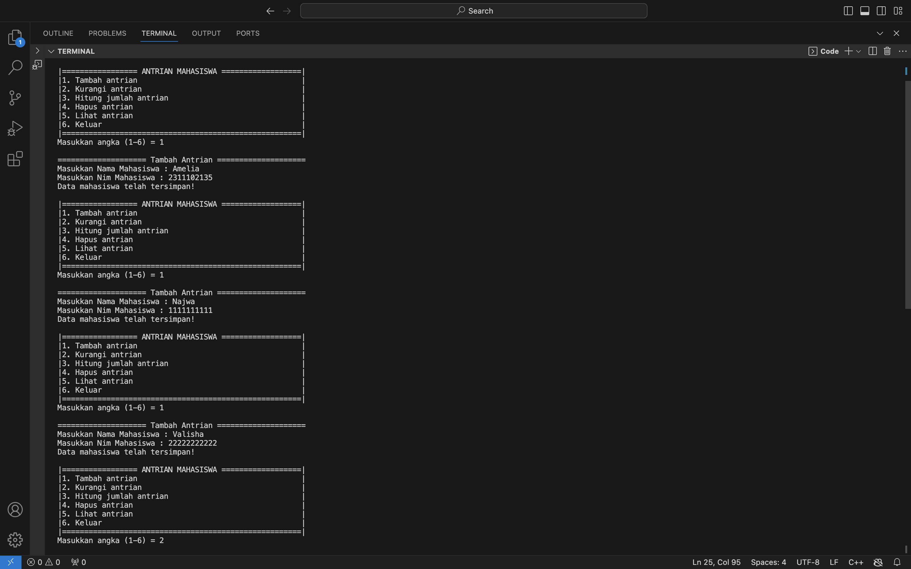
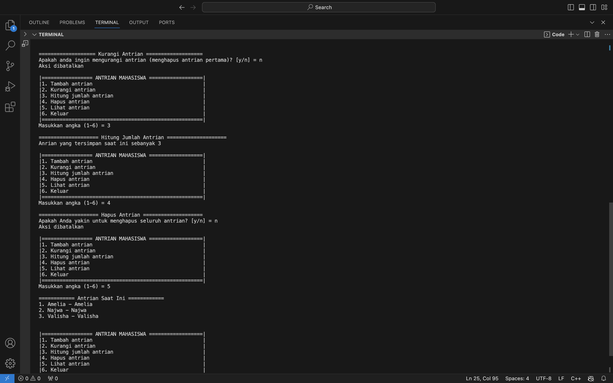
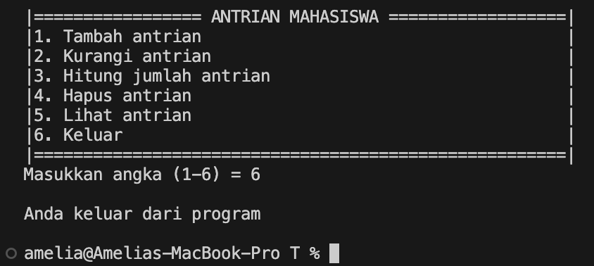

# <h1 align="center">Laporan Praktikum Modul Algoritma Searching</h1>
<p align="center">Amelia Azmi_2311102135</p>

## Dasar Teori


## Guided 

### 1. [Guided]

```C++
#include <iostream>

using namespace std;

int main () {
    int n = 10;
    int data [n] = {9, 4, 1, 7, 5, 12, 4, 13, 4, 10}; 
    int cari = 10;
    bool ketemu = false; // Variabel boolean untuk melacak apakah nilai ditemukan
    int i;

    // Loop melalui array untuk mencari nilai
    for (i = 0; i < n; i++) { 
        if (data[i] == cari) {
            ketemu = true;
            break;
        }
    }

    cout << "Program Sequential Search" << endl;
    cout << "data: {9, 4, 1, 7, 5, 12, 4, 13, 4, 10}" << endl;

    // Memeriksa apakah nilai ditemukan dan mencetak pesan yang sesuai
    if (ketemu) { 
        cout << "\nAngka " << cari << " ditemukan pada indeks ke- " << i << endl;
    } else {
        cout << cari << " tidak dapat ditemukan pada data." << endl;
    }

    return 0;
}
```
Program di atas merupakan implementasi sederhana dari algoritma pencarian berurutan (sequential search) dalam bahasa C++. 
Berikut adalah deskripsi rinci dari program tersebut:

Program dimulai dengan mengimpor pustaka `iostream` yang diperlukan untuk operasi input dan output. Selanjutnya, menggunakan namespace `std` untuk menghindari penulisan `std::` sebelum fungsi standar C++ seperti `cout` dan `endl`. Dalam fungsi `main()`, variabel `n` dideklarasikan dan diinisialisasi dengan nilai 10, yang menunjukkan jumlah elemen dalam array `data`. Array `data` berisi 10 elemen integer: `{9, 4, 1, 7, 5, 12, 4, 13, 4, 10}`. Variabel `cari` diinisialisasi dengan nilai 10, yang merupakan nilai yang akan dicari dalam array. Variabel boolean `ketemu` diinisialisasi dengan `false` untuk melacak apakah nilai yang dicari ditemukan dalam array. Kemudian program menggunakan loop `for` untuk iterasi melalui elemen-elemen array `data`. Dalam setiap iterasi, elemen array pada indeks `i` dibandingkan dengan nilai `cari`. Jika ditemukan kecocokan (yaitu `data[i] == cari`), variabel `ketemu` diubah menjadi `true`, dan loop dihentikan menggunakan `break`. Setelah loop selesai, program mencetak pesan "Program Sequential Search" dan isi array `data` untuk memberikan konteks kepada pengguna. Program kemudian memeriksa nilai `ketemu`. Jika `ketemu` bernilai `true`, program mencetak pesan bahwa nilai `cari` ditemukan pada indeks ke-`i`. Jika tidak, program mencetak bahwa nilai `cari` tidak ditemukan dalam array. Selanjutnya, fungsi `main()` mengembalikan 0, menandakan bahwa program telah berakhir dengan sukses. Secara keseluruhan, program ini menggambarkan bagaimana mencari sebuah nilai dalam array menggunakan pencarian berurutan dan memberikan hasil pencarian kepada pengguna.

### 2. [Guided]

```C++
#include <iostream>
#include <conio.h> 
#include <iomanip>

using namespace std;

int dataArray[7] = {1,8,2,5,4,9,7};
int cari;


// Fungsi untuk melakukan selection sort pada array
void selection_sort(){
    int temp, min, i, j;
    for (i = 0; i < 7; i++)
    {
        min = i;
        for (j = i + 1; j < 7; j++)
        {
            if (dataArray[j] < dataArray[min])
            {
                min = j;
            }
        }

        // Tukar elemen terkecil yang ditemukan dengan elemen pada posisi i
        temp = dataArray[i];
        dataArray[i] = dataArray[min];
        dataArray[min] = temp;
    }
}

// Fungsi untuk melakukan pencarian biner pada array
void binarySearch(){
    int awal, akhir, tengah;
    bool b_flag = false; // Flag untuk menandakan apakah data ditemukan
    awal = 0;
    akhir = 6;
    while (!b_flag && awal <= akhir)
    {
        tengah = (awal + akhir)/2;
        if (dataArray[tengah] == cari)
        {
            b_flag = true;  // Data ditemukan
        } else if (dataArray[tengah] <  cari)
        {
            awal = tengah +1; // Cari di bagian kanan
        } else {
            akhir = tengah -1; // Cari di bagian kiri
        }
    }
    if (b_flag){
        cout << "\nData ditemukan pada index ke- " << tengah <<endl;
    } else {
        cout << "\nDATA TIDAK DITEMUKAN" << endl;
    }
}

int main() {
    cout << "BINARY SEARCH"<<endl;
    cout << "\nData : ";

     // Menampilkan data array sebelum diurutkan
    for (int x =0; x < 7; x++)
    {
        cout <<setw(3)<<dataArray[x];
    }
    cout << endl;

    cout << "Masukkan data yang ingin dicari : ";
    cin >> cari;

    cout << "\nData diurutkan : ";
    selection_sort(); // Memanggil fungsi untuk mengurutkan array

    // Menampilkan data array setelah diurutkan
    for (int x = 0; x < 7; x++)
    {
        cout <<setw(3)<<dataArray[x];
    }
    cout <<endl;
    binarySearch(); // Memanggil fungsi untuk melakukan pencarian biner_getche(); // Menunggu pengguna menekan tombol sebelum keluar
    return 0;
}
```
Program ini merupakan implementasi dari algoritma pengurutan seleksi (selection sort) dan pencarian biner (binary search) dalam bahasa C++. Program dimulai dengan mendeklarasikan dan menginisialisasi sebuah array `dataArray` yang berisi tujuh elemen integer. Kemudian, program mendefinisikan dua fungsi: `selection_sort` dan `binarySearch`. Fungsi `selection_sort` berkerja untuk mengurutkan array secara ascending dengan cara menemukan elemen terkecil dalam bagian yang tidak diurutkan dan menukarnya dengan elemen pada posisi awal dari bagian tersebut. Setelah pengurutan, fungsi `binarySearch` digunakan untuk mencari nilai yang diinput oleh pengguna dalam array yang sudah diurutkan. Algoritma pencarian biner bekerja dengan membagi dua array dan menentukan apakah nilai yang dicari berada di bagian kiri atau kanan, mempersempit ruang pencarian hingga nilai ditemukan atau dinyatakan tidak ada. Di dalam fungsi `main`, program menampilkan array sebelum dan sesudah diurutkan, meminta pengguna untuk memasukkan nilai yang ingin dicari, kemudian menggunakan kedua fungsi tadi untuk mengurutkan array dan mencari nilai tersebut, akhirnya mencetak hasil pencarian ke layar. Program ini menunjukkan bagaimana kombinasi algoritma pengurutan dan pencarian dapat digunakan untuk mencari data secara efisien dalam array.

## Unguided 

### 1. [Ubahlah penerapan konsep queue pada bagian guided dari array menjadi linked list]

```C++
#include<iostream>

using namespace std;

//Deklarasi struct node
struct node{ //node berisi variabel nama_135 dan pointer next
    string nama_135;
    node *next;
};
    node *front; //deklarasi node front 
    node *back; //deklarasi node back

//Prosedur inisialisasi node front dan back sebagai NULL
void Inisialisasi_135(){ 
    front = NULL;
    back = NULL;
}

//Fungsi untuk mengecek apakah queue kosong atau tidak
bool isEmpty_135(){
    if (front == 0){
        return true; //jika antrian pertama tidak ada, maka antrian kosong (kembalikan true)
    } else {
        return false; //jika antrian pertama ada, maka antrian tidak kosong (kembalikan false)
    }
}

//Prosedur untuk menambahkan data pada antrian
void TambahData_135(string name_135){
    node *baru = new node; //tambah node baru
    baru->nama_135 = name_135; //node baru berisi variabel name_135
    baru->next = NULL; //next dari node baru adalah NULL
    if(isEmpty_135() == true){ //jika antrian kosong, maka lanjutkan
        front = back = baru; //node baru sebagai front dan back
        back->next = NULL; //node selanjutnya dari node baru adalah NULL
    } else if(isEmpty_135() == false){ //jika antrian tidak kosong, maka lanjutkan
        back->next = baru; //node baru sebagai node selanjutnya dari antrian yang sudah ada
        back = baru; //node baru sebagai back
    }
}

//Prosedur untuk mengurangi antrian (lanjut ke antrian selanjutnya)
void KurangiAntrian_135(){
    node *hapus; //inisialisasi node hapus
    if(isEmpty_135() == true){ //jika antrian kosong, maka tampilkan "Antrian masih kosong!"
        cout << "Antrian masih kosong!" << endl;
    } else if(isEmpty_135() == false){ //jika antrian tidak kosong, maka lanjutkan
        if(front->next != NULL){ //jika node selanjutnya setelah antrian pertama bukan NULL, maka lanjutkan
            hapus = front; //node hapus sebagai front
            front = front->next; //pindahkan front ke node selanjutnya setelah node pertama
            delete hapus; //hapus node pertama
        } else { //jika tidak ada node selanjutnya setelah antrian pertama, maka lanjutkan
            front = back = NULL; //front dan back adalah NULL
        }
    }
}

//Fungsi untuk menghitung jumlah antrian
int HitungAntrian_151(){
    node *hitung; //inisialisasi node hitung
    hitung = front; //node hitung sebagai front
    int jumlah_135 = 0; //inisialisasi variabel jumlah_135
    while(hitung != NULL){ //jika node hitung bukan NULL, maka ulangi
        hitung = hitung->next; //node hitung berlanjut ke node selanjutnya
        jumlah_135++; //variabel jumlah_135 bertambah nilainya
    }
    return jumlah_135; //kembalikan nilai variabel jumlah_135
}

//Prosedur untuk menghapus seluruh antrian
void HapusAntrian_135(){
    node *hapus, *bantu; //inisialisasi node hapus dan node bantu
    bantu = front; //node bantu sebagai front
    while(bantu != NULL){ ///jika node bantu bukan NULL, maka ulangi
        hapus = bantu; //node hapus sama dengan node bantu
        bantu = bantu->next; //node selanjutnya dari posisi node bantu saat ini, juga merupakan node bantu
        delete hapus; //hapus seluruh node yang merupakan node bantu
    }
    front = back = NULL; //front dan back sebagai NULL
}

//Prosedur untuk menampilkan antrian
void LihatAntrian_135(){
    node *bantu; //inisialisasi node bantu
    bantu = front; //node bantu sebagai front
    if(isEmpty_135() == true){ //jika antrian kosong, maka tampilkan "Antrian kosong!" 
        cout << "Antrian kosong!" << endl; 
    } else if(isEmpty_135() == false){ //jika antrian tidak kosong, maka lanjutkan
        cout << "======== Antrian saat ini ========" << endl;  
        int NomorAntrian_135 = 1; //inisialisasi variabel NomorAntrian_135 dengan nilai 1
        while(bantu != NULL){ //jika node bantu bukan NULL, maka ulangi
            cout << NomorAntrian_135 << ". " << bantu->nama_135 << endl; //tampilkan antrian dengan nomor urutnya
            bantu = bantu->next; //node bantu berlanjut ke node selanjutnya
            NomorAntrian_135++; //nomor antrian bertambah
        }
    }
    cout << endl;
}

int main(){
    //Menambah 3 data nama kedalam antrian
    TambahData_135("Amelia");
    TambahData_135("Indi");
    TambahData_135("Ayu");

    //Menampilkan data yang sudah ditambahkan
    LihatAntrian_135();

    //Mengurangi data
    KurangiAntrian_135();

    //menampilkan data setelah dikurangi
    LihatAntrian_135();

    //Menghapus seluruh antrian
    HapusAntrian_135();

    //menampilkan data setelah dihapus
    LihatAntrian_135();
    
    return 0;
}
```
#### Output:


Program di atas merupakan implementasi struktur data antrian (queue) menggunakan linked list dalam bahasa C++. Antrian diwakili oleh struct `node`, yang berisi data `nama_135` dan pointer `next` untuk menunjuk ke node berikutnya. Dua pointer global, `front` dan `back`, digunakan untuk melacak elemen pertama dan terakhir dari antrian. Prosedur `Inisialisasi_135` mengatur `front` dan `back` menjadi `NULL` untuk mengindikasikan bahwa antrian kosong pada awalnya. Fungsi `isEmpty_135` memeriksa apakah antrian kosong dengan memeriksa apakah `front` adalah `NULL`. Prosedur `TambahData_135` menambahkan elemen baru ke antrian: jika antrian kosong, elemen baru menjadi `front` dan `back`; jika tidak, elemen baru ditambahkan di akhir antrian dan `back` diperbarui. Prosedur `KurangiAntrian_135` menghapus elemen pertama dari antrian, memperbarui `front` ke elemen berikutnya, atau mengatur `front` dan `back` ke `NULL` jika hanya ada satu elemen. Fungsi `HitungAntrian_151` menghitung jumlah elemen dalam antrian dengan melintasi seluruh elemen dari `front` ke `back`. Prosedur `HapusAntrian_135` menghapus semua elemen dalam antrian dengan melintasi dan menghapus setiap elemen satu per satu, kemudian mengatur `front` dan `back` ke `NULL`. Prosedur `LihatAntrian_135` menampilkan semua elemen dalam antrian; jika antrian kosong, menampilkan pesan "Antrian kosong!". Fungsi `main` menambahkan tiga nama ke dalam antrian, menampilkan antrian, menghapus satu elemen, menampilkan antrian setelah penghapusan, menghapus seluruh antrian, dan menampilkan antrian setelah semua elemen dihapus. Program ini menggambarkan operasi dasar antrian seperti penambahan, penghapusan, pengecekan, dan penghapusan keseluruhan menggunakan linked list.

### 2. [Dari nomor 1 buatlah konsep antri dengan atribut Nama mahasiswa dan NIM Mahasiswa]

```C++
#include<iostream>

using namespace std;

//Deklarasi struct node
struct node{ //node berisi variabel NamaMahasiswa_151, NIM_151, dan pointer next
    string NamaMhs_135;
    string Nim_135;
    node *next;
};
    node *front; //Deklarasi node front
    node *back; //Deklarasi node back

//Prosedur inisialisasi node front dan back sebagai NULL
void Inisialisasi_135(){ 
    front = NULL;
    back = NULL;
}

//Fungsi untuk mengecek apakah queue kosong atau tidak
bool isEmpty_135(){
    if (front == 0){
        return true; //jika antrian pertama tidak ada, maka antrian kosong (kembalikan true)
    } else {
        return false; //jika antrian pertama ada, maka antrian tidak kosong (kembalikan false)
    }
}

//Prosedur untuk menambahkan data pada antrian
void TambahData_135(string Nama_135, string Nim_151){
    node *baru = new node; //tambah node baru
    baru->NamaMhs_135 = Nama_135; //node baru berisi nama mahasiswa dan NIM 
    baru->Nim_135 = Nama_135; 
    baru->next = NULL; //next dari node baru adalah NULL
    if(isEmpty_135() == true){ //jika antrian kosong, maka lanjutkan
        front = back = baru; //node baru sebagai front dan back
        back->next = NULL; //node selanjutnya dari node baru adalah NULL
    } else if(isEmpty_135() == false){ //jika antrian tidak kosong, maka lanjutkan
        back->next = baru; //node baru sebagai node selanjutnya dari antrian yang sudah ada
        back = baru; //node baru sebagai back
    }
}

//Prosedur untuk mengurangi antrian (lanjut ke antrian selanjutnya)
void KurangiAntrian_135(){
    node *hapus; //inisialisasi node hapus
    if(isEmpty_135() == false){ //jika antrian tidak kosong, maka lanjutkan
        if(front->next != NULL){ //jika node selanjutnya setelah antrian pertama bukan NULL, maka lanjutkan
            hapus = front; //node hapus sebagai front
            front = front->next; //pindahkan front ke node selanjutnya setelah node pertama
            delete hapus; //hapus node pertama
        } else { //jika tidak ada node selanjutnya setelah antrian pertama, maka lanjutkan
            front = back = NULL; //front dan back adalah NULL
        }
    }
}

//Fungsi untuk menghitung jumlah antrian
int HitungAntrian_135(){
    node *hitung; //inisialisasi node hitung
    hitung = front; //node hitung sebagai front
    int jumlah_135 = 0; //inisialisasi variabel jumlah_135
    while(hitung != NULL){ //jika node hitung bukan NULL, maka ulangi
        hitung = hitung->next; //node hitung berlanjut ke node selanjutnya
        jumlah_135++; //variabel jumlah_151 bertambah nilainya
    }
    return jumlah_135; //kembalikan nilai variabel jumlah_135
}

//Prosedur untuk menghapus seluruh antrian
void HapusAntrian_135(){
    node *hapus, *bantu; //inisialisasi node hapus dan node bantu
    bantu = front; //node bantu sebagai front
    while(bantu != NULL){ ///jika node bantu bukan NULL, maka ulangi
        hapus = bantu; //node hapus sama dengan node bantu
        bantu = bantu->next; //node selanjutnya dari posisi node bantu saat ini, juga merupakan node bantu
        delete hapus; //hapus seluruh node yang merupakan node bantu
    }
    front = back = NULL; //front dan back sebagai NULL
}

//Prosedur untuk menampilkan antrian
void LihatAntrian_135(){
    node *bantu; //inisialisasi node bantu
    bantu = front; //node bantu sebagai front
    if(isEmpty_135() == true){ //jika antrian kosong, maka tampilkan "Antrian kosong!" 
        cout << "Antrian kosong!" << endl; 
    } else if(isEmpty_135() == false){ //jika antrian tidak kosong, maka lanjutkan
        cout << "============ Antrian Saat Ini ============" << endl; 
        int NomorAntrian_135 = 1; //inisialisasi variabel NomorAntrian_135 dengan nilai 1
        while(bantu != NULL){ //jika node bantu bukan NULL, maka ulangi
            cout << NomorAntrian_135 << ". " << bantu->NamaMhs_135 << " - " << bantu->Nim_135 << endl; //tampilkan antrian dengan nomor urut, nama mahasiswa - NIM
            bantu = bantu->next; //node bantu berlanjut ke node selanjutnya
            NomorAntrian_135++; //nomor antrian bertambah
        }
    }
    cout << endl;
}

int main(){
    string NamaMhs_135, Nim_135; 
    int Pilih_135; 
    char Yakin_135;
    MenuUtama:
    cout << "|================= ANTRIAN MAHASISWA ==================|" << endl; //Tampilan menu antrian mahasiswa
    cout << "|1. Tambah antrian                                     |" << endl;
    cout << "|2. Kurangi antrian                                    |" << endl;
    cout << "|3. Hitung jumlah antrian                              |" << endl;
    cout << "|4. Hapus antrian                                      |" << endl;
    cout << "|5. Lihat antrian                                      |" << endl;
    cout << "|6. Keluar                                             |" << endl;
    cout << "|======================================================|" << endl;
    cout << "Masukkan angka (1-6) = ";
    cin >> Pilih_135;
    cout << endl;
    switch(Pilih_135){ //switch case berdasarkan pilihan user
        case 1: //jika user memilih 1, maka tampilkan menu tambah antrian
            cout << "==================== Tambah Antrian ====================" << endl;
            cout << "Masukkan Nama Mahasiswa : ";
            cin >> NamaMhs_135;
            cout << "Masukkan Nim Mahasiswa : ";
            cin >> Nim_135;
            TambahData_135 (NamaMhs_135, Nim_135); //pemanggilan prosedur TambahData_135 dengan parameter nama mahasiswa dan NIM
            cout << "Data mahasiswa telah tersimpan!" << endl;
            cout << endl;
            goto MenuUtama;
            break;
        case 2: //jika user memilih 2, maka tampilkan menu kurangi antrian
            cout << "==================== Kurangi Antrian ====================" << endl;
            if(isEmpty_135() == true){ //Jika antrian kosong, maka tampilkan "Antrian masih kosong!"
                cout << "Antrian masih kosong!" << endl;
            } else { //jika antrian tidak kosong, maka lanjutkan
                cout << "Apakah anda ingin mengurangi antrian (menghapus antrian pertama)? [y/n] = "; //validasi keyakinan user untuk mengurangi antrian
                cin >> Yakin_135;
                if(Yakin_135 == 'y' || Yakin_135 == 'Y'){ //jika user menginputkan y atau Y, maka lanjutkan
                    KurangiAntrian_135(); //pemanggilan prosedur KurangiAntrian_135()
                    cout << "Antrian telah dikurangi" << endl;
                } else if(Yakin_135 == 'n' || Yakin_135 == 'Y'){ //jika user menginputkan n atau N, maka tampilkan "Aksi dibatalkan"
                    cout << "Aksi dibatalkan" << endl;
                }
            }
            cout << endl;
            goto MenuUtama;
            break;
        case 3: //jika user memilih 3, maka tampilkan menu Hitung Jumlah Antrian
            cout << "==================== Hitung Jumlah Antrian ====================" << endl;
            cout << "Anrian yang tersimpan saat ini sebanyak " << HitungAntrian_135() << endl; //Pemanggilan fungsi HitungAntrian_135()
            cout << endl;
            goto MenuUtama;
            break;
        case 4: //jika user memilih 4, maka tampilkan menu hapus antrian
            cout << "==================== Hapus Antrian ====================" << endl;
            cout << "Apakah Anda yakin untuk menghapus seluruh antrian? [y/n] = "; //validasi keyakinan user untuk menghapus seluruh antrian
            cin >> Yakin_135;
            if(Yakin_135 == 'y' || Yakin_135 == 'Y'){ //jika user menginputkan y atau Y, maka lanjutkan
                HapusAntrian_135(); //pemanggilan prosedur HapusAntrian_135()
                cout << "Antrian telah dihapus" << endl;
            } else if(Yakin_135 == 'n' || Yakin_135 == 'N'){ //jika user menginputkan n atau N, maka tampilkan "Aksi dibatalkan"
                cout << "Aksi dibatalkan" << endl;
            }
            cout << endl;
            goto MenuUtama;
            break;
        case 5: //jika user memilih 5, maka tampilkan antrian
            LihatAntrian_135(); //pemanggilan prosedur LihatAntrian_135()
            cout << endl;
            goto MenuUtama;
            break;
        case 6:
            cout << "Anda keluar dari program" << endl;
            cout << endl;
            return 0;
            break;
        default: //jika user memilih selain 1-5, maka tampilkan "Pilihan yang anda masukkan salah!"
            cout << "Pilihan yang anda masukkan salah!" << endl;
            cout << endl;
            goto MenuUtama;
            break;
    }
}
```
#### Output:







Program diatas merupakan implementasi antrian (queue) menggunakan struktur data linked list dalam bahasa C++. Program ini mendefinisikan sebuah struct `node` yang merepresentasikan setiap elemen antrian, berisi atribut `NamaMhs_135`, `Nim_135`, dan pointer `next` yang menunjuk ke elemen berikutnya. Dua pointer global `front` dan `back` digunakan untuk melacak elemen pertama dan terakhir dalam antrian. Program dimulai dengan menginisialisasi `front` dan `back` ke `NULL`, menandakan bahwa antrian kosong.

Fungsi `isEmpty_135` digunakan untuk memeriksa apakah antrian kosong dengan memeriksa apakah `front` adalah `NULL`. Prosedur `TambahData_135` menambahkan elemen baru ke antrian di posisi paling belakang, dan memperbarui pointer `back` untuk menunjuk ke elemen baru ini. Jika antrian kosong, elemen baru menjadi `front` dan `back`. Prosedur `KurangiAntrian_135` menghapus elemen pertama dalam antrian dengan memindahkan `front` ke elemen berikutnya dan menghapus elemen pertama. Jika hanya ada satu elemen, maka `front` dan `back` diatur ke `NULL`.

Fungsi `HitungAntrian_135` menghitung jumlah elemen dalam antrian dengan melintasi semua elemen dari `front` hingga `NULL`. Prosedur `HapusAntrian_135` menghapus semua elemen dalam antrian satu per satu hingga antrian kosong. Prosedur `LihatAntrian_135` menampilkan semua elemen dalam antrian beserta nomor urutnya. Jika antrian kosong, akan ditampilkan pesan "Antrian kosong!". 

Fungsi `main` menyediakan antarmuka pengguna berbasis teks yang menawarkan opsi untuk menambah antrian, mengurangi antrian, menghitung jumlah antrian, menghapus antrian, dan melihat antrian. Setiap opsi dalam menu diproses menggunakan pernyataan `switch`, dan setelah menyelesaikan setiap tugas, pengguna dikembalikan ke menu utama. Program terus berlanjut hingga pengguna memilih untuk keluar. Dengan struktur ini, program memberikan cara yang sistematis dan interaktif untuk mengelola antrian mahasiswa.

## Kesimpulan

Queue adalah struktur data yang digunakan untuk menyimpan elemen-elemen dengan prinsip First In First Out (FIFO), yang berarti elemen yang pertama kali dimasukkan ke dalam antrian akan keluar pertama kali. Dua operasi utama yang dapat dilakukan pada queue adalah enqueue, yang digunakan untuk menambahkan elemen baru ke dalam antrian, dan dequeue, yang digunakan untuk mengeluarkan elemen dari antrian. Queue dapat diimplementasikan menggunakan Linear Array atau Circular Array, dan struktur data queue umumnya dideklarasikan dengan variabel-variabel seperti jumlah data, ujung depan, ujung belakang, dan array isi queue. Terdapat beberapa operasi umum yang dapat dilakukan pada queue, seperti enqueue untuk menambahkan elemen, dequeue untuk mengeluarkan elemen, display untuk menampilkan isi queue, isEmpty untuk memeriksa apakah antrian kosong, isFull untuk memeriksa apakah antrian penuh, destroy/clear untuk menghapus semua elemen, dan peek untuk melihat nilai elemen pertama tanpa menghapusnya. Setiap operasi memiliki fungsi khususnya masing-masing dalam mengelola antrian, sehingga memungkinkan untuk manipulasi dan penggunaan data secara efisien dalam struktur queue.

## Referensi

[1] Ahmad Ghiyas Ahyar, et al. 2021. JURNAL PEMBELAJARAN ARRAY, LINKED LIST, STACK, DAN QUEUE.

[2] Gunawan, R., Yuana, H., & Kirom, S. 2023. Implementasi Metode Queue pada Sistem Antrian Online Berbasis Web: Studi Kasus UPTD Puskesmas Sananwetan. ATI (Jurnal Mahasiswa Teknik Informatika), 7(3), 1538.

[3] Johnson Sihombing. 2019 . PENERAPAN STACK DAN QUEUE PADA
ARRAY DAN LINKED LIST DALAM JAVA. Bandung.