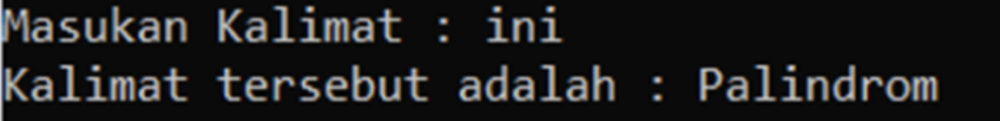
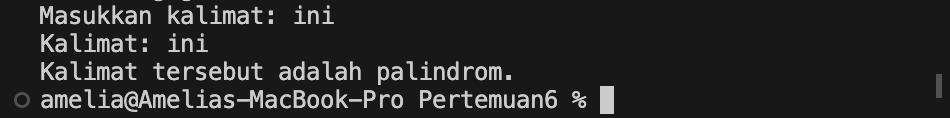
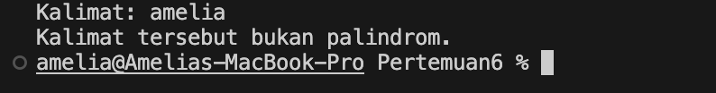
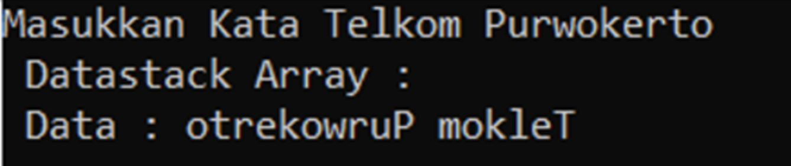
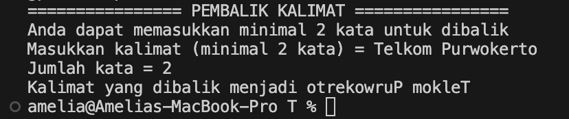

# <h1 align="center">Laporan Praktikum Modul Stack</h1>
<p align="center">Amelia Azmi_2311102135</p>

## Dasar Teori

### Pengertian Stack
Stack adalah suatu koleksi atau kumpulan item data yang terorgaisasi dalam bentuk urutan linear, yang operasi pemasukan dan penghapusan datanya dilakukan pada salah satu sisinya. Sedangkan pengertian stack pada struktur data adalah sebagai tumpukan dari benda, sekumpulan data
yang seolah-olah diletakkan di atas data yang lain, koleksi dari objek-objek homogen, atau suatu urutan elemen yang elemennya dapat diambil dan ditambah hanya pada posisi akhir (top) saja. Stack merupakan bentuk khusus dari suatu struktur data, dimana node yang ditambahkan
ke dalam list dan diambil dari list hanya pada kepalanya, atau dengan prinsip pengolahannya adalah last-in first-out (LIFO). Pada struktur ini hanya ada dua fungsi utama, yaitu push (memasukkan node ke dalam stack), dan pop (mengambil node dari stack).


Deklarasi Struktur Data Stack
```C++
const int maxsize = 100; // Mendefinisikan maks ukuran data dalam stack
struct stack {
    int top;            // Indeks TOP
    char items[maxsize];// Array
};
```

### Operasi Dasar Pada Stack
1. Create : merupakan operator yang berfungsi untuk membuat sebuah stack kosong.
```C++
struct STACK {
    int top;
    float data[5];
    };
    float dta;
    struct STACK stackbaru;
```C++

2. IsEmpty : merupakan operator yang berfungsi untuk menentukan apakah suatu stack merupakan stack kosong. Tanda bahwa sebuah stack kosong adalah Top bernilai kurang dari nol (-1).
```C++
bool isempty() {
    if (stackbaru.top==1) return true;
    else return false;
}
```

3. IsFull : merupakan operator yang digunakan untuk memeriksa apakah stack yang ada sudah penuh. Stack akan penuh jika puncak stack terletak tepat dibawah jumlah maksimum yang dapat ditampung stack (Top = MAX_STACK-1).
```C++
bool isfull() {
    if (stackbaru.top==maxstack) return
    true;
    else return false;
}
```

4. Push : merupakan operator yang berfungsi untuk menambahkan satu elemen ke dalam stack dan tidak dapat dilakukan jika stack dalam keadaan penuh.
```C++
void push(float dta) {
    if (isfull()==false) {
        puts("stack penuh");
        } else {
            stackbaru.top++;
            stackbaru.data[top]=dta;
            }
}
```

5. Pop : merupakan operator yang berfungsi untuk mengeluarkan satu elemen teratas dari dalam stack dengan syarat stack tidak dalam kondisi kosong.
```C++
void pop() {
    if (isempty()==false) {
        cout<<"data kosong";
        } else {
            cout<<"data yang terambil : "<<stackbaru.data[top]<<endl;
            stackbaru.top--;
            }
}
```

6. Clear : fungsi yang digunakan untuk mengosongkan stack dengan cara mengeset Top dengan -1. Jika Top bernilai kurang dari nol maka stack dianggap kosong.
```C++
void clear () {
    top=-1
}
```

7. Retrieve : fungsi yang digunakan untuk melihat nilai yang berada pada posisi tumpukan teratas
```C++
void print() {
    for (int i=0; i<=top; i++) {
        cout<<stackbaru.data[i]<<"";
        }
}
```
#### Kelebihan dan kekurangan dalam menggunakan Stack:

##### 1. Kelebihan

~ Menggunakan metode LIFO untuk membantu mengelola data dengan mudah dan efektif.

~ Secara otomatis membersihkan objek yang tidak lagi diperlukan.

~ Tidak mudah rusak karena ukuran variabel yang tetap.

~ Ukuran variabel tidak dapat diubah.

~ Mengontrol memori secara mandiri.

##### 2. Kekurangan

~ Memori stack cenderung terbatas.

~ Ada kemungkinan stack akan meluap atau overflow jika objek terlalu banyak dimasukan.

~ Tidak dapat mengakses data secara acak, karena harus mengeluarkan tumpukan paling atas terlebih dahulu untuk membuat proses pencarian menjadi lebih terstruktur dan berurutan.

### 1. [Guided]

```C++
#include<iostream>

using namespace std;

//Deklarasi array bernama arrayBuku dengan ukuran 5
string arrayBuku[5];
int maksimal = 5, top = 0;

//Fungsi isFull untuk memeriksa apakah stack full atau tidak
bool isFull(){
    return (top == maksimal);
}

//Fungsi isEmpty untuk memeriksa apakah stack kosong atau tidak
bool isEmpty(){
    return (top == 0);
}

//Prosedur push untuk menambahkan elemen pada stack posisi paling atas
void pushArrayBuku(string data){
    if(isFull()){
        cout << "Data telah penuh" << endl;
    } else {
        arrayBuku[top] = data;
        top++;
    }
}

//Prosedur pop untuk menghapus elemen pada stack posisi paling atas
void popArrayBuku(){
    if(isEmpty()){
        cout << "tidak ada data yang dihapus" << endl;
    } else {
        arrayBuku[top - 1] = "";
        top--;
    }
}

//Prosedur peek untuk melihat elemen pada stack posisi tertentu 
void peekArrayBuku(int posisi){
    if(isEmpty()){
        cout << "tidak ada data yang bisa dilihat" << endl;
    } else {
        int index = top;
        for(int i = 1; i <= posisi; i++){
            index--;
        }
        cout << "Posisi ke-" << posisi << " adalah " << arrayBuku[index] << endl;
    }
}

//Fungsi Count untuk menghitung jumlah elemen pada stack
int countStack(){
    return top;
}

//Prosedur change untuk mengubah elemen posisi tertentu pada stack
void changeArrayBuku(int posisi, string data){
    if(posisi > top){
        cout << "Posisi melebihi data yang ada" << endl;
    } else {
        int index = top;
        for(int i = 1; i <= posisi; i++){
            index--;
        }
        arrayBuku[index] = data;
    }
}

//Prosedur destroy atau clear untuk menghapus semua elemen pada stack
void destroyArrayBuku(){
    for(int i = top; i >= 0; i--){
        arrayBuku[i] = "";
    }
    top = 0;
}

//Prosedur cetak untuk menampilkan semua elemen pada stack
void cetakArrayBuku(){
    if(isEmpty()){
        cout << "tidak ada data yang bisa dicetak" << endl;
    } else {
        for (int i = top - 1; i >= 0; i--){
            cout << arrayBuku[i] << endl;
        }
    }
}

int main(){
    //Menambahkan elemen pada stack menggunakan prosedur push
    pushArrayBuku("Kalkulus");
    pushArrayBuku("Struktur Data");
    pushArrayBuku("Matematika Diskrit");
    pushArrayBuku("Dasar Multimedia");
    pushArrayBuku("Inggris");

    //mencetak semua elemen pada stack menggunakan prosedur cetak
    cetakArrayBuku();
    cout << "\n";

    //Memeriksa apakah stack penuh atau tidak menggunakan fungsi isFull
    cout << "Apakah data stack penuh? " << isFull() << endl;

    //Memeriksa apakah stack kosong atau tidak menggunakan fungsi isEmpty
    cout << "Apakah data stack kosong? " << isEmpty() << endl;
    cout << "\n";

    //Melihat elemen pada stack posisi ke 2 menggunakan prosedur peek
    peekArrayBuku(2);

    //Menghapus elemen stack posisi paling atas menggunakan prosedur pop
    popArrayBuku();
    cout << "\n";

    //Menghitung jumlah elemen pada stack menggunakan fungsi count
    cout << "Banyaknya data = " << countStack() << endl;

    //Mengubah elemen stack posisi ke 2 menjadi "Bahasa Jerman" menggunakan prosedur change
    changeArrayBuku(2, "Bahasa Jerman");

    //mencetak semua elemen pada stack menggunakan prosedur cetak
    cetakArrayBuku();
    cout << "\n";

    //Menghapus semua elemen pada stack menggunakan prosedur destroy atau clear
    destroyArrayBuku();

    //Menghitung jumlah elemen pada stack menggunakan fungsi count
    cout << "Jumlah data setelah dihapus = " << countStack() << endl;

    //mencetak semua elemen pada stack menggunakan prosedur cetak
    cetakArrayBuku();

    return 0;
}
```
Kode diatas merupakan sebuah implementasi dari struktur data stack menggunakan array dalam bahasa pemrograman C++. Stack merupakan struktur data yang mengadopsi prinsip LIFO (Last In, First Out), di mana elemen yang terakhir dimasukkan akan menjadi yang pertama dikeluarkan. Dalam program ini, sebuah array bernama `arrayBuku` dengan ukuran 5 dideklarasikan untuk bertindak sebagai stack penyimpanan nama buku. Melalui serangkaian fungsi dan prosedur, program ini memungkinkan operasi dasar pada stack, seperti menambahkan elemen ke atas stack dengan fungsi `pushArrayBuku()`, menghapus elemen dari atas stack dengan `popArrayBuku()`, serta melihat, mengubah, menghitung jumlah, dan menghapus seluruh elemen pada stack. Program utama mengilustrasikan penggunaan fungsi-fungsi dan prosedur-prosedur tersebut dengan contoh penggunaan nyata, seperti menambahkan beberapa nama buku ke stack, mencetaknya, memeriksa apakah stack penuh atau kosong, dan melakukan operasi lainnya.

## Unguided 

### 1. [Buatlah program untuk menentukan apakah kalimat tersebut yang diinputkan dalam program stack adalah palindrom/tidak. Palindrom kalimat yang dibaca dari depan dan belakang sama. Jelaskan bagaimana cara kerja programnya.]

Contoh:

Kalimat : ini

Kalimat tersebut adalah polindrom

Kalimat : telkom

Kalimat tersebut adalah bukan polindrom



```C++
//Edited by amelia azmi_2311102135
#include <iostream>
#include <string>
#include <algorithm>
using namespace std;

// Fungsi untuk memeriksa apakah sebuah kalimat adalah palindrom
bool isPalindrome_135(const string& kal) {
    string strippedSentence_135;

    // Menghapus spasi dan tanda baca dari kalimat, dan mengonversi huruf menjadi lowercase
    for (char r047 : kal) {
        if (isalpha(r047)) {
            strippedSentence_135 += tolower(r047); // Menambahkan karakter yang valid ke dalam kalimat tanpa tanda baca dan spasi
        }
    }

    string reversedSentence_135 = strippedSentence_135;
    reverse(reversedSentence_135.begin(), reversedSentence_135.end()); 
    // Membalikkan kalimat untuk memeriksa apakah sama dengan kalimat asli
    
    return strippedSentence_135 == reversedSentence_135; // Mengembalikan nilai true jika kalimat adalah palindrom, dan false jika tidak
}

int main() {
    string kal;
    cout << "Masukkan kalimat: ";
    getline(cin, kal);

    bool isPalindrom_135 = isPalindrome_135(kal); // Memanggil fungsi isPalindrome untuk memeriksa apakah kalimat adalah palindrom atau tidak

    cout << "Kalimat: " << kal << endl;

    // Menampilkan hasil apakah kalimat adalah palindrom atau tidak
    if (isPalindrom_135) {
        cout << "Kalimat tersebut adalah palindrom." << endl;
    } else {
        cout << "Kalimat tersebut bukan palindrom." << endl;
    }

    return 0; // Mengembalikan nilai 0, menandakan bahwa program berjalan dengan sukses
}
```
#### Output:



Kode diatas merupakan sebuah program yang dirancang untuk memeriksa apakah sebuah kalimat yang telah dimasukkan pengguna merupakan palindrom atau tidak. Palindrom adalah sebuah kata, frasa, angka, atau urutan lainnya yang dapat dibaca sama baik dari depan maupun dari belakang. Pertama, program meminta pengguna untuk memasukkan sebuah kalimat menggunakan fungsi `getline(cin, kal)`. Setelah mendapatkan input, program memproses kalimat tersebut untuk membersihkan dari spasi dan tanda baca. Hal ini dilakukan dengan menggunakan sebuah loop for yang mengiterasi setiap karakter dalam kalimat. Jika karakter tersebut merupakan huruf (diperiksa dengan fungsi `isalpha()`), maka karakter tersebut ditambahkan ke dalam string `strippedSentence_135` setelah diubah menjadi huruf kecil dengan fungsi `tolower()`. Ini memastikan bahwa perbandingan antara kalimat asli dan kalimat yang dibalik tidak terpengaruh oleh perbedaan huruf besar kecil. Selanjutnya, program membuat sebuah salinan terbalik dari kalimat yang telah dibersihkan dengan menggunakan fungsi `reverse()` dari library `<algorithm>`. Setelah mendapatkan kalimat yang terbalik, program membandingkannya dengan kalimat asli. Jika kedua kalimat tersebut sama, maka kalimat tersebut merupakan palindrom, dan program mengeluarkan pesan yang sesuai. Kemudian, program menampilkan pesan apakah kalimat tersebut merupakan palindrom atau tidak berdasarkan hasil perbandingan yang telah dilakukan. Hal ini dilakukan melalui sebuah kondisi if-else yang memeriksa nilai yang dikembalikan oleh fungsi `isPalindrome_135`. Selanjutnya program mengembalikan nilai 0 dari fungsi `main()` sebagai tanda bahwa program telah selesai dijalankan dengan sukses.

### 2. [Buatlah program untuk melakukan pembalikan terhadap kalimat menggunakan stack dengan minimal 3 kata. Jelaskan output program dan source codenya beserta operasi/fungsi yang dibuat?]

Contoh :

Kalimat : Telkom Purwokerto

Hasil : otrekowruP mokleT



```C++
//Edited by amelia azmi_2311102135
#include<iostream>

using namespace std;

const int Max_135 = 100;
string ArrayKalimat_135 [Max_135 ]; //deklarasi array bernama ArrayKalimat sebagai stack
int Top_135  = 0;

//fungsi isEmpty untuk mengecek apakah stack kosong atau tidak
bool isEmpty(){
    return (Top_135  == 0);
}

//prosedur PushKata_135  untuk menambahkan kata pada stack
void PushKata_135 (string InputKata_135 ){
    if(!InputKata_135 .empty()){  // Periksa apakah input kata tidak kosong
        ArrayKalimat_135 [Top_135 ] = InputKata_135 ;
        Top_135 ++;
    }
}

//prosedur PopKata_135  untuk mengeluarkan elemen pertama pada stack
void PopKata_135 (){
    if(Top_135  > 0){
        ArrayKalimat_135 [Top_135  - 1] = "";
        Top_135 --;
    }
}

//fungsi HitungKata_135  untuk menghitung jumlah kata yang diinputkan user
int HitungKata_135 (const char* InputKata_135 ){
    int JumlahKata_135  = 0;
    int i = 0;
    while (InputKata_135 [i] != '\0') {
        // Jika karakter saat ini bukan spasi dan karakter selanjutnya adalah spasi atau null terminator,
        // itu menandakan bahwa kata baru dimulai.
        if (InputKata_135 [i] != ' ' && (InputKata_135 [i + 1] == ' ' || InputKata_135 [i + 1] == '\0')) {
            JumlahKata_135 ++;
        }
        i++;
    }
    return JumlahKata_135 ;
}

//Fungsi BalikKatav untuk membalikkan urutan huruf pada kata di kalimat yang diinputkan user
string BalikKata_135 (const char* InputKata_135 ){
    string KalimatTerbalik_135 ; //variabel untuk menampung kata yang sudah terbalik secara keseluruhan
    string KataBelumTerbalik_135 ;  // variabel untuk menampung kata sementara yang belum dibalik
    string KataSudahTerbalik_135 ; //variabel untuk menampung kata sementara yang sudah dibalik
    int i = 0;
    //perulangan while
    while (InputKata_135 [i] != '\0') { //jika setiap elemen pada InputKata_135  bukan spasi, maka lanjutkan
        char Huruf_135  = InputKata_135 [i]; //masukkan setiap elemen pada InputKata_135  pada variabel Huruf_135 
        //percabangan if-else
        if (Huruf_135  != ' ') { //jika karakter yang sedang diproses bukan spasi, maka lanjutkan
            KataBelumTerbalik_135  += Huruf_135 ; //tambahkan karakter bukan spasi ke dalam KataBelumTerbalik_135 
        } else { //jika karakter yang sedang diproses adalah spasi, maka lanjutkan
            int PanjangKata_135 = KataBelumTerbalik_135 .length(); //Hitung panjang kata pada KataBelumTerbalik_135 
            for (int j = PanjangKata_135  - 1; j >= 0; --j) {
                KataSudahTerbalik_135  += KataBelumTerbalik_135 [j]; //balikkan kata pada KataBelumTerbalik_135  dan masukkan kedalam KataSudahTerbalik_135 
            }
            //Tambahkan kata yang sudah terbalik ke dalam stack menggunakan PushKata_135 
            if (!KataSudahTerbalik_135 .empty()) {
                PushKata_135 (KataSudahTerbalik_135 );
            }
            KataBelumTerbalik_135 = "";  // Kosongkan KataBelumTerbalik_135  untuk menampung kata baru
            KataSudahTerbalik_135  = "";  // Kosongkan KataBelumTerbalik_135  untuk menampung kata baru
        }
        ++i;
    }
    // Balik kata terakhir jika setelah kata tersebut tidak diikuti oleh spasi
    if(!KataBelumTerbalik_135 .empty()) {
        int PanjangKata_135  = KataBelumTerbalik_135 .length(); //Hitung panjang kata 
        for (int j = PanjangKata_135  - 1; j >= 0; --j) {
            KataSudahTerbalik_135 += KataBelumTerbalik_135 [j]; //balikkan kata dan masukkan kedalam KataSudahTerbalik_135 
        }
        if (!KataSudahTerbalik_135.empty()) { //Tambahkan kata yang sudah terbalik ke dalam stack menggunakan PushKata_135 
            PushKata_135(KataSudahTerbalik_135);
        }
    }
    
    //keluarkan kata yang sudah dibalik dari stack
    while(!isEmpty()){
        KalimatTerbalik_135 += ArrayKalimat_135[Top_135 - 1]; //masukkan kata yang sudah dibalik kedalam KalimatTerbalik_135 
        PopKata_135(); //keluarkan KalimatTerbalik_151 menggunakan PopKata_135 
        if (!isEmpty()) { // Jika stack belum kosong, tambahkan spasi di antara kata yang sudah dibalik
            KalimatTerbalik_135 += " ";
        }
    }
    return KalimatTerbalik_135; //kembalikan nilai KalimatTerbalik_135 
}

int main(){
    char InputKata_135[Max_135];
    string KalimatTerbalik_135, hasil_135;
    cout << "================ PEMBALIK KALIMAT ================" << endl;
    cout << "Anda dapat memasukkan minimal 2 kata untuk dibalik" << endl;
    MasukkanKalimat:
    cout << "Masukkan kalimat (minimal 2 kata) = ";
    cin.getline(InputKata_135 , Max_135);  //Kalimat yang diinputkan user dimasukkan kedalam array InputKata_135 

    //Pengecekan apakah kata yang diinputkan user lebih dari 2 atau tidak
    if(HitungKata_135(InputKata_135) < 2){ //Jika kata yang dimasukkan user kurang dari 2 maka user harus memasukkan kalimat lagi 
        cout << "Jumlah kata = " << HitungKata_135(InputKata_135) << endl;
        cout << "Kata yang telah anda masukkan kurang dari 2, silahkan masukkan ulang kalimat anda" << endl;
        cout << endl;
        goto MasukkanKalimat;
    } else { //jika kata yang diinputkan user lebih dari sama dengan 2 maka tampilkan urutan huruf setiap kata pada kalimat secara terbalik
        cout << "Jumlah kata = " << HitungKata_135(InputKata_135) << endl;
        hasil_135 = BalikKata_135(InputKata_135);
        cout << "Kalimat yang dibalik menjadi " << hasil_135 << endl;
    }
    
    return 0;
}
```
#### Output:


Program 
Program diatas merupakan sebuah implementasi dalam bahasa C++ yang bertujuan untuk membalikkan urutan huruf dalam setiap kata dari sebuah kalimat yang dimasukkan oleh pengguna. Dengan menggunakan struktur data stack, program ini memproses kalimat secara bertahap untuk menghasilkan kalimat yang terbalik secara keseluruhan.

Pertama-tama, program memulai dengan mendeklarasikan beberapa variabel yang diperlukan, seperti `ArrayKalimat_135` yang berperan sebagai stack untuk menampung kata-kata dalam kalimat, `Top_135` yang menyimpan indeks atas dari stack, dan `Max_135` sebagai batas maksimum dari stack. Kemudian, program juga mendeklarasikan variabel lain seperti `InputKata_135` untuk menampung kalimat yang dimasukkan oleh pengguna, serta variabel `KalimatTerbalik_135` dan `hasil_135` untuk menampung hasil dari pemrosesan kalimat.

Selanjutnya, program mendefinisikan beberapa fungsi dan prosedur yang digunakan dalam proses pembalikan kata-kata, seperti `isEmpty()` untuk memeriksa apakah stack kosong, `PushKata_135()` untuk menambahkan kata ke dalam stack, `PopKata_135()` untuk mengeluarkan elemen teratas dari stack, `HitungKata_135()` untuk menghitung jumlah kata dalam kalimat yang dimasukkan pengguna, dan `BalikKata_135()` untuk membalikkan urutan huruf dalam setiap kata dalam kalimat.

Fungsi utama `main()` kemudian dimulai dengan meminta pengguna untuk memasukkan kalimat. Program melakukan validasi apakah kalimat yang dimasukkan mengandung minimal 2 kata. Jika tidak memenuhi syarat, program akan meminta pengguna untuk memasukkan kalimat lagi. Namun, jika kalimat memenuhi syarat, program akan memanggil fungsi `BalikKata_135()` untuk membalikkan urutan huruf dalam setiap kata. Setelah itu, program akan menampilkan hasil balikan kata-kata tersebut kepada pengguna.

Secara keseluruhan, program ini memberikan pengalaman interaktif kepada pengguna untuk memasukkan kalimat dan melihat hasilnya yang sudah dibalik urutan kata-katanya. Dengan menggunakan konsep stack dan pemrosesan string, program ini memberikan solusi untuk membalikkan kalimat secara efisien dalam bahasa C++.

## Kesimpulan
Stack adalah struktur data yang mengikuti prinsip last-in, first-out (LIFO), yang berarti elemen terakhir yang dimasukkan adalah elemen pertama yang dikeluarkan. Struktur data stack memiliki operasi dasar seperti create, isEmpty, isFull, push, pop, clear, dan retrieve. Dalam implementasinya, sebuah stack dapat dideklarasikan menggunakan array dan memiliki fungsi-fungsi yang memungkinkan untuk manipulasi data di dalamnya, seperti menambahkan (push) dan mengeluarkan (pop) elemen, serta mengambil nilai dari elemen teratas.

## Referensi

[1] J Sihombing. Penerapan Stack dan Queue Pada Array dan Linked List Dalam Java. 2019.

[2] Muhammad Nugraha, Dasar Pemrograman Dengan C++, Materi Paling Dasar untuk Menjadi Programmer Berbagai Platform. 2021 Yogyakarta: Deepublish.

[3] Mochamad Fajar Wicaksono, S.Kom., M.Kom.. Percabangan, Stack, Subrutin dan Delay. 2020. Unikom : Bandung.