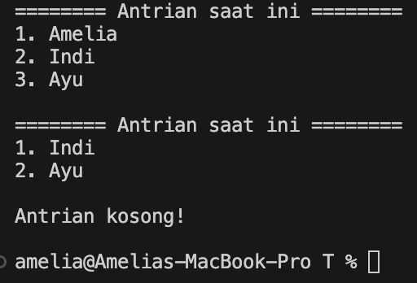

# <h1 align="center">Laporan Praktikum Modul Queue</h1>
<p align="center">Amelia Azmi_2311102135</p>

## Dasar Teori

queue (antrian) adalah suatu jenis struktur data yang dapat diproses dengan sifat FIFO (First In First Out), dimana elemen yang pertama kali masuk ke antrian akan keluar pertama kalinya. Ada dua jenis operasi yang bias dilakukan di antrian : enqueue (memasukkan elemen baru ke dalam elemen) dan dequeue (adalah mengeluarkan satu elemen dari suatu antrian). Antrian dapat dibuat dengan menggunakan Liniear Array dan Circular Array.

#### Ilustrasi Proses Queue


#### Operasi pada Queue

Berikut ini adalah beberapa operasi umum yang dapat dilakukan pada queue:

1. Enqueue: Operasi ini digunakan untuk menambahkan elemen baru ke ujung antrian. Proses ini dapat dilakukan selama antrian tidak penuh. Setiap kali elemen ditambahkan (enqueue), variabel `rear` atau penunjuk posisi belakang akan bertambah 1.

2. Dequeue: Operasi ini digunakan untuk menghapus elemen pertama dari antrian. Penghapusan elemen hanya dapat dilakukan jika antrian tidak kosong; jika tidak, akan terjadi underflow. Setelah penghapusan elemen pertama, perlu dilakukan penyesuaian dengan menggeser elemen-elemen berikutnya.

3. Display atau View: Operasi ini digunakan untuk menampilkan semua elemen yang ada dalam antrian.

4. IsEmpty: Operasi ini digunakan untuk memeriksa apakah antrian kosong. Untuk menghindari underflow saat melakukan dequeue, penting untuk memastikan bahwa antrian tidak kosong. Antrian dikatakan kosong jika penunjuk posisi belakang bernilai 0. Biasanya, operasi ini diimplementasikan sebagai fungsi yang mengembalikan nilai `true` jika antrian kosong dan `false` jika tidak.

5. IsFull: Operasi ini digunakan untuk memeriksa apakah antrian sudah penuh. Saat melakukan enqueue, perlu dipastikan bahwa antrian tidak penuh untuk menghindari overflow. Antrian dikatakan penuh jika penunjuk posisi belakang mencapai kapasitas maksimal antrian. Operasi ini biasanya diimplementasikan sebagai fungsi yang mengembalikan nilai `true` jika antrian penuh dan `false` jika tidak.

6. Destroy atau Clear: Operasi ini digunakan untuk menghapus semua elemen dalam antrian. Biasanya, operasi ini memeriksa apakah antrian tidak kosong menggunakan fungsi `IsEmpty` sebelum melakukan penghapusan. Jika antrian kosong, akan ditampilkan pesan bahwa antrian sudah kosong.

7. Peek: Operasi ini digunakan untuk mendapatkan nilai elemen pertama dalam antrian tanpa menghapusnya.


## Guided 

### 1. [Guided]

```C++
#include<iostream>

using namespace std;

const int MaksimalAntrian = 5;
int front = 0;
int back = 0;
string QueueTeller[5];

// Mengecek apakah antrian sudah penuh atau belum
bool isFull(){
    if(back == MaksimalAntrian){
        return true;
    } else {
        return false;
    }
}

// Mengecek apakah antrian masih kosong atau tidak
bool isEmpty(){
    if(back == 0){
        return true;
    } else {
        return false;
    }
}

// Menambah antrian
void TambahData(string nama){
    if(isFull()){
        cout << "Antrian sudah penuh" << endl;
    } else if(!isFull()){
        if(isEmpty()){
            QueueTeller[0] = nama;
            front++;
            back++;
        } else if(!isEmpty()){
            QueueTeller[back] = nama;
            back++;
        }
    }
}

// Mengurangi antrian
void KurangAntrian(){
    if(isEmpty()){
        cout << "Antrian masih kosong" << endl;
    } else if(!isEmpty()){
        for(int i = 0; i < back; i++){
            QueueTeller[i] =  QueueTeller[i+1];
        }
        back--;
    }
}

// Menghitung banyak antrian
int Count(){
    return back;
}

// Menghapus seluruh antrian
void ClearQueue(){
    if(isEmpty()){
        cout << "Antrian masih kosong" << endl;
    } else if(!isEmpty()){
        for(int i = 0; i < back; i++){
            QueueTeller[i] = "";
        }
        back = 0;
        front = 0;
    }
}

// Melihat Antrian
void ViewQueue(){
    cout << "Data antrian = " << endl;
    for(int i = 0; i < MaksimalAntrian; i++){
        if(QueueTeller[i] != ""){
            cout << i+1 << ". " << QueueTeller[i] << endl;
        } else {
            cout << i+1 << ". " << "(kosong)" << endl;
        }
    }
}

// main fungsi
int main(){
    
    //Menambah 3 data nama kedalam antrian
    TambahData("Alya");
    TambahData("Kiki");
    TambahData("Artika");

    //menampilkan data yang sudah ditambahkan
    ViewQueue();

    //mengurangi data
    KurangAntrian();

    //menampilkan data setelah dikurangi
    ViewQueue();

    //menghapus seluruh antrian
    ClearQueue();

    //menampilkan data setelah dihapus
    ViewQueue();
}
```
Program diatas merupakan implementasi sederhana dari struktur data antrian (queue) menggunakan array dalam bahasa pemrograman C++. Dalam program ini, antrian direpresentasikan oleh array `QueueTeller` yang memiliki ukuran maksimal yang ditentukan oleh konstanta `MaksimalAntrian`. Variabel `front` dan `back` digunakan untuk menandai posisi depan dan belakang antrian. Program ini memiliki beberapa fungsi utama, seperti `TambahData()`, `KurangAntrian()`, `ClearQueue()`, dan `ViewQueue()`, yang memungkinkan pengguna untuk menambah, mengurangi, menghapus, dan melihat data dalam antrian.

Fungsi `TambahData(nama)` digunakan untuk menambahkan data ke dalam antrian jika antrian belum penuh. Sebaliknya, fungsi `KurangAntrian()` digunakan untuk mengurangi data dari antrian jika antrian tidak kosong. Fungsi `ClearQueue()` menghapus semua data dalam antrian, sedangkan fungsi `ViewQueue()` digunakan untuk menampilkan seluruh data dalam antrian.

Program ini memberikan contoh penggunaan dengan menambahkan beberapa nama ke antrian menggunakan fungsi `TambahData()`, kemudian mengurangi satu nama dari antrian dengan fungsi `KurangAntrian()`, dan akhirnya menghapus seluruh antrian menggunakan fungsi `ClearQueue()`. Setiap kali ada perubahan dalam antrian, status antrian ditampilkan dengan memanggil fungsi `ViewQueue()`. Dengan demikian, program ini memberikan gambaran tentang bagaimana struktur data antrian diimplementasikan menggunakan array dalam bahasa pemrograman C++.

## Unguided 

### 1. [Ubahlah penerapan konsep queue pada bagian guided dari array menjadi linked list]

```C++
#include<iostream>

using namespace std;

//Deklarasi struct node
struct node{ //node berisi variabel nama_135 dan pointer next
    string nama_135;
    node *next;
};
    node *front; //deklarasi node front 
    node *back; //deklarasi node back

//Prosedur inisialisasi node front dan back sebagai NULL
void Inisialisasi_135(){ 
    front = NULL;
    back = NULL;
}

//Fungsi untuk mengecek apakah queue kosong atau tidak
bool isEmpty_135(){
    if (front == 0){
        return true; //jika antrian pertama tidak ada, maka antrian kosong (kembalikan true)
    } else {
        return false; //jika antrian pertama ada, maka antrian tidak kosong (kembalikan false)
    }
}

//Prosedur untuk menambahkan data pada antrian
void TambahData_135(string name_135){
    node *baru = new node; //tambah node baru
    baru->nama_135 = name_135; //node baru berisi variabel name_135
    baru->next = NULL; //next dari node baru adalah NULL
    if(isEmpty_135() == true){ //jika antrian kosong, maka lanjutkan
        front = back = baru; //node baru sebagai front dan back
        back->next = NULL; //node selanjutnya dari node baru adalah NULL
    } else if(isEmpty_135() == false){ //jika antrian tidak kosong, maka lanjutkan
        back->next = baru; //node baru sebagai node selanjutnya dari antrian yang sudah ada
        back = baru; //node baru sebagai back
    }
}

//Prosedur untuk mengurangi antrian (lanjut ke antrian selanjutnya)
void KurangiAntrian_135(){
    node *hapus; //inisialisasi node hapus
    if(isEmpty_135() == true){ //jika antrian kosong, maka tampilkan "Antrian masih kosong!"
        cout << "Antrian masih kosong!" << endl;
    } else if(isEmpty_135() == false){ //jika antrian tidak kosong, maka lanjutkan
        if(front->next != NULL){ //jika node selanjutnya setelah antrian pertama bukan NULL, maka lanjutkan
            hapus = front; //node hapus sebagai front
            front = front->next; //pindahkan front ke node selanjutnya setelah node pertama
            delete hapus; //hapus node pertama
        } else { //jika tidak ada node selanjutnya setelah antrian pertama, maka lanjutkan
            front = back = NULL; //front dan back adalah NULL
        }
    }
}

//Fungsi untuk menghitung jumlah antrian
int HitungAntrian_151(){
    node *hitung; //inisialisasi node hitung
    hitung = front; //node hitung sebagai front
    int jumlah_135 = 0; //inisialisasi variabel jumlah_135
    while(hitung != NULL){ //jika node hitung bukan NULL, maka ulangi
        hitung = hitung->next; //node hitung berlanjut ke node selanjutnya
        jumlah_135++; //variabel jumlah_135 bertambah nilainya
    }
    return jumlah_135; //kembalikan nilai variabel jumlah_135
}

//Prosedur untuk menghapus seluruh antrian
void HapusAntrian_135(){
    node *hapus, *bantu; //inisialisasi node hapus dan node bantu
    bantu = front; //node bantu sebagai front
    while(bantu != NULL){ ///jika node bantu bukan NULL, maka ulangi
        hapus = bantu; //node hapus sama dengan node bantu
        bantu = bantu->next; //node selanjutnya dari posisi node bantu saat ini, juga merupakan node bantu
        delete hapus; //hapus seluruh node yang merupakan node bantu
    }
    front = back = NULL; //front dan back sebagai NULL
}

//Prosedur untuk menampilkan antrian
void LihatAntrian_135(){
    node *bantu; //inisialisasi node bantu
    bantu = front; //node bantu sebagai front
    if(isEmpty_135() == true){ //jika antrian kosong, maka tampilkan "Antrian kosong!" 
        cout << "Antrian kosong!" << endl; 
    } else if(isEmpty_135() == false){ //jika antrian tidak kosong, maka lanjutkan
        cout << "======== Antrian saat ini ========" << endl;  
        int NomorAntrian_135 = 1; //inisialisasi variabel NomorAntrian_135 dengan nilai 1
        while(bantu != NULL){ //jika node bantu bukan NULL, maka ulangi
            cout << NomorAntrian_135 << ". " << bantu->nama_135 << endl; //tampilkan antrian dengan nomor urutnya
            bantu = bantu->next; //node bantu berlanjut ke node selanjutnya
            NomorAntrian_135++; //nomor antrian bertambah
        }
    }
    cout << endl;
}

int main(){
    //Menambah 3 data nama kedalam antrian
    TambahData_135("Amelia");
    TambahData_135("Indi");
    TambahData_135("Ayu");

    //Menampilkan data yang sudah ditambahkan
    LihatAntrian_135();

    //Mengurangi data
    KurangiAntrian_135();

    //menampilkan data setelah dikurangi
    LihatAntrian_135();

    //Menghapus seluruh antrian
    HapusAntrian_135();

    //menampilkan data setelah dihapus
    LihatAntrian_135();
    
    return 0;
}
```
#### Output:



Program di atas merupakan implementasi struktur data antrian (queue) menggunakan linked list dalam bahasa C++. Antrian diwakili oleh struct `node`, yang berisi data `nama_135` dan pointer `next` untuk menunjuk ke node berikutnya. Dua pointer global, `front` dan `back`, digunakan untuk melacak elemen pertama dan terakhir dari antrian. Prosedur `Inisialisasi_135` mengatur `front` dan `back` menjadi `NULL` untuk mengindikasikan bahwa antrian kosong pada awalnya. Fungsi `isEmpty_135` memeriksa apakah antrian kosong dengan memeriksa apakah `front` adalah `NULL`. Prosedur `TambahData_135` menambahkan elemen baru ke antrian: jika antrian kosong, elemen baru menjadi `front` dan `back`; jika tidak, elemen baru ditambahkan di akhir antrian dan `back` diperbarui. Prosedur `KurangiAntrian_135` menghapus elemen pertama dari antrian, memperbarui `front` ke elemen berikutnya, atau mengatur `front` dan `back` ke `NULL` jika hanya ada satu elemen. Fungsi `HitungAntrian_151` menghitung jumlah elemen dalam antrian dengan melintasi seluruh elemen dari `front` ke `back`. Prosedur `HapusAntrian_135` menghapus semua elemen dalam antrian dengan melintasi dan menghapus setiap elemen satu per satu, kemudian mengatur `front` dan `back` ke `NULL`. Prosedur `LihatAntrian_135` menampilkan semua elemen dalam antrian; jika antrian kosong, menampilkan pesan "Antrian kosong!". Fungsi `main` menambahkan tiga nama ke dalam antrian, menampilkan antrian, menghapus satu elemen, menampilkan antrian setelah penghapusan, menghapus seluruh antrian, dan menampilkan antrian setelah semua elemen dihapus. Program ini menggambarkan operasi dasar antrian seperti penambahan, penghapusan, pengecekan, dan penghapusan keseluruhan menggunakan linked list.

### 2. [Dari nomor 1 buatlah konsep antri dengan atribut Nama mahasiswa dan NIM Mahasiswa]

```C++
#include <iostream>
using namespace std;

int main() {
    cout << "ini adalah file code unguided praktikan" << endl;
    return 0;
}
```
#### Output:


Kode di atas digunakan untuk mencetak teks "ini adalah file code guided praktikan" ke layar menggunakan function cout untuk mengeksekusi nya.

## Kesimpulan
Ringkasan dan interpretasi pandangan kalia dari hasil praktikum dan pembelajaran yang didapat[1].

## Referensi

[1] Ahmad Ghiyas Ahyar, et al. 2021. JURNAL PEMBELAJARAN ARRAY, LINKED LIST, STACK, DAN QUEUE.
[2] Gunawan, R., Yuana, H., & Kirom, S. 2023. Implementasi Metode Queue pada Sistem Antrian Online Berbasis Web: Studi Kasus UPTD Puskesmas Sananwetan. ATI (Jurnal Mahasiswa Teknik Informatika), 7(3), 1538.