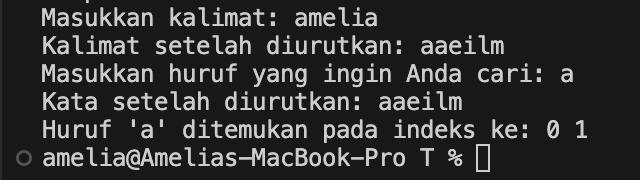
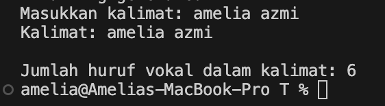

# <h1 align="center">Laporan Praktikum Modul Algoritma Searching</h1>
<p align="center">Amelia Azmi_2311102135</p>

## Dasar Teori

#### Sequential Search 
Sequential Search adalah proses membandingkan setiap elemen array satu persatu secara beruntun dimulai dari elemen pertama hingga elemen yang dicari ditemukan atau hingga elemen terakhir dari array. Metode Sequential Search atau disebut pencarian beruntun dapat digunakan untuk melakukan pencarian data baik pada array yang sudah terurut maupun yang belum terurut. 

Proses Algoritma Sequential Searching adalah sebagai berikut:
a. Pertama data melakukan perbandingan satu per satu secara berurutan dalam kumpulan data dengan data yang di cari sampai data tersebut ditemukan atau tidak ditemukan
b. Pada dasarnya, pencarian ini hanya melakukan pengulangan data dari 1 sampai dengan jumlah data (n).
c. Setiap pengulangan, dibandingkan data ke-i dengan data yang sedang dicari.
d. Apabila data sama dengan yang dicari, berarti data telah berhasil di temukan. Sebaliknya apabila sampai akhir melakukan pengulangan tidak ada data yang sama dengan yang dicari, berarti data tidak ada yang ditemukan.

Urutan Algoritma Sequential Searching:
1. i <- 0
2. Ketemu <- false
3. Selama ( tidak ketemu ) dan ( i < N ) kerjakan baris 4
4. Jika ( Data[i] = key ) maka ketemu <- true Jika tidak i <- i + 1
5. Jika ( Ketemu ) maka i adalah indeks dari data yang dicari

Berikut adalah contoh soal untuk pencarian sekuensial beserta penjelasannya:

Int A[6] = {13, 87, 14, 21, 75, 53}


~ Misal nilai yang dicari adalah X = 21, maka elemen yang diperiksa adalah 13, 87, 14, 21. (ditemukan) Jadi indeks larik yang dikembalikan : I = 3

~ Misal nilai yang dicari adalah X = 15, maka elemen yang diperiksa adalah 13, 87, 14, 21, 75, 53. (tidak ditemukan) Jadi indeks larik yang dikembalikan : I = 0

#### Binary Search 
Binary Search merupakan sebuah teknik pencarian data dengancara berulang kali membagi separuh dari jumlah data yang dicari sampai sehingga memperkecil lokasi pencarian menjadi satu data. Algotihma ini biasanya banyak digunakan untuk mencari di program dengan jumlah data yang banyak, dimana kompleksitas dari algorithma ini adalah Ο(log n) di mana n adalah jumlah item. Pada saat menggunakan binary search, data yang berada di dalam array harus diurutkan terlebih dahulu.mencari data pada posisi ekstrem (awal, akhir dan tengah deretan). Syaratnya : data harus sudah dalam keadaan terurut.
Proses searching akan dihentikan jika terpenuhi 2 (dua) kondisi:
1. Jika data yang dicari sudah ditemukan.
2. Jika sudah tidak ada lagi data yang harus diperiksa.

Contoh Binary Search :


## Guided 

### 1. [Buatlah sebuah project dengan menggunakan sequential search sederhana untuk melakukan pencarian data]

```C++
#include <iostream>

using namespace std;

int main () {
    int n = 10;
    int data [n] = {9, 4, 1, 7, 5, 12, 4, 13, 4, 10}; 
    int cari = 10;
    bool ketemu = false; // Variabel boolean untuk melacak apakah nilai ditemukan
    int i;

    // Loop melalui array untuk mencari nilai
    for (i = 0; i < n; i++) { 
        if (data[i] == cari) {
            ketemu = true;
            break;
        }
    }

    cout << "Program Sequential Search" << endl;
    cout << "data: {9, 4, 1, 7, 5, 12, 4, 13, 4, 10}" << endl;

    // Memeriksa apakah nilai ditemukan dan mencetak pesan yang sesuai
    if (ketemu) { 
        cout << "\nAngka " << cari << " ditemukan pada indeks ke- " << i << endl;
    } else {
        cout << cari << " tidak dapat ditemukan pada data." << endl;
    }

    return 0;
}
```
Program di atas merupakan implementasi sederhana dari algoritma pencarian berurutan (sequential search) dalam bahasa C++. 
Berikut adalah deskripsi rinci dari program tersebut:

Program dimulai dengan mengimpor pustaka `iostream` yang diperlukan untuk operasi input dan output. Selanjutnya, menggunakan namespace `std` untuk menghindari penulisan `std:` sebelum fungsi standar C++ seperti `cout` dan `endl`. Dalam fungsi `main()`, variabel `n` dideklarasikan dan diinisialisasi dengan nilai 10, yang menunjukkan jumlah elemen dalam array `data`. Array `data` berisi 10 elemen integer: `{9, 4, 1, 7, 5, 12, 4, 13, 4, 10}`. Variabel `cari` diinisialisasi dengan nilai 10, yang merupakan nilai yang akan dicari dalam array. Variabel boolean `ketemu` diinisialisasi dengan `false` untuk melacak apakah nilai yang dicari ditemukan dalam array. Kemudian program menggunakan loop `for` untuk iterasi melalui elemen-elemen array `data`. Dalam setiap iterasi, elemen array pada indeks `i` dibandingkan dengan nilai `cari`. Jika ditemukan kecocokan (yaitu `data[i] == cari`), variabel `ketemu` diubah menjadi `true`, dan loop dihentikan menggunakan `break`. Setelah loop selesai, program mencetak pesan "Program Sequential Search" dan isi array `data` untuk memberikan konteks kepada pengguna. Program kemudian memeriksa nilai `ketemu`. Jika `ketemu` bernilai `true`, program mencetak pesan bahwa nilai `cari` ditemukan pada indeks ke-`i`. Jika tidak, program mencetak bahwa nilai `cari` tidak ditemukan dalam array. Selanjutnya, fungsi `main()` mengembalikan 0, menandakan bahwa program telah berakhir dengan sukses. Secara keseluruhan, program ini menggambarkan bagaimana mencari sebuah nilai dalam array menggunakan pencarian berurutan dan memberikan hasil pencarian kepada pengguna.

### 2. [Buatlah sebuah project anak melakukan perncarian data dengan menggunakan binary search]

```C++
#include <iostream>
#include <conio.h> 
#include <iomanip>

using namespace std;

int dataArray[7] = {1,8,2,5,4,9,7};
int cari;


// Fungsi untuk melakukan selection sort pada array
void selection_sort(){
    int temp, min, i, j;
    for (i = 0; i < 7; i++)
    {
        min = i;
        for (j = i + 1; j < 7; j++)
        {
            if (dataArray[j] < dataArray[min])
            {
                min = j;
            }
        }

        // Tukar elemen terkecil yang ditemukan dengan elemen pada posisi i
        temp = dataArray[i];
        dataArray[i] = dataArray[min];
        dataArray[min] = temp;
    }
}

// Fungsi untuk melakukan pencarian biner pada array
void binarySearch(){
    int awal, akhir, tengah;
    bool b_flag = false; // Flag untuk menandakan apakah data ditemukan
    awal = 0;
    akhir = 6;
    while (!b_flag && awal <= akhir)
    {
        tengah = (awal + akhir)/2;
        if (dataArray[tengah] == cari)
        {
            b_flag = true;  // Data ditemukan
        } else if (dataArray[tengah] <  cari)
        {
            awal = tengah +1; // Cari di bagian kanan
        } else {
            akhir = tengah -1; // Cari di bagian kiri
        }
    }
    if (b_flag){
        cout << "\nData ditemukan pada index ke- " << tengah <<endl;
    } else {
        cout << "\nDATA TIDAK DITEMUKAN" << endl;
    }
}

int main() {
    cout << "BINARY SEARCH"<<endl;
    cout << "\nData : ";

     // Menampilkan data array sebelum diurutkan
    for (int x =0; x < 7; x++)
    {
        cout <<setw(3)<<dataArray[x];
    }
    cout << endl;

    cout << "Masukkan data yang ingin dicari : ";
    cin >> cari;

    cout << "\nData diurutkan : ";
    selection_sort(); // Memanggil fungsi untuk mengurutkan array

    // Menampilkan data array setelah diurutkan
    for (int x = 0; x < 7; x++)
    {
        cout <<setw(3)<<dataArray[x];
    }
    cout <<endl;
    binarySearch(); // Memanggil fungsi untuk melakukan pencarian biner_getche(); // Menunggu pengguna menekan tombol sebelum keluar
    return 0;
}
```
Program ini merupakan implementasi dari algoritma pengurutan seleksi (selection sort) dan pencarian biner (binary search) dalam bahasa C++. Program dimulai dengan mendeklarasikan dan menginisialisasi sebuah array `dataArray` yang berisi tujuh elemen integer. Kemudian, program mendefinisikan dua fungsi: `selection_sort` dan `binarySearch`. Fungsi `selection_sort` berkerja untuk mengurutkan array secara ascending dengan cara menemukan elemen terkecil dalam bagian yang tidak diurutkan dan menukarnya dengan elemen pada posisi awal dari bagian tersebut. Setelah pengurutan, fungsi `binarySearch` digunakan untuk mencari nilai yang diinput oleh pengguna dalam array yang sudah diurutkan. Algoritma pencarian biner bekerja dengan membagi dua array dan menentukan apakah nilai yang dicari berada di bagian kiri atau kanan, mempersempit ruang pencarian hingga nilai ditemukan atau dinyatakan tidak ada. Di dalam fungsi `main`, program menampilkan array sebelum dan sesudah diurutkan, meminta pengguna untuk memasukkan nilai yang ingin dicari, kemudian menggunakan kedua fungsi tadi untuk mengurutkan array dan mencari nilai tersebut, akhirnya mencetak hasil pencarian ke layar. Program ini menunjukkan bagaimana kombinasi algoritma pengurutan dan pencarian dapat digunakan untuk mencari data secara efisien dalam array.

## Unguided 

### 1. [Buatlah sebuah program untuk mencari sebuh huruf pada sebuah kalimat yang sudah diinput dengan menggunakan binary search]

```C++
#include <iostream>
#include <string>

using namespace std;
// Fungsi untuk mengurutkan karakter dalam string menggunakan Bubble Sort
void bubble_sort(string &kalimat_135)
{
    int n = kalimat_135.size();
    // Perulangan untuk setiap elemen dalam string
    for (int i = 0; i < n - 1; ++i)
    {
        for (int j = 0; j < n - i - 1; ++j)
        {
            if (kalimat_135[j] > kalimat_135[j + 1])
            {
                swap(kalimat_135[j], kalimat_135[j + 1]);
            }
        }
    }
}
// Fungsi untuk mencari karakter dalam string yang sudah diurutkan
void binary_search(const string &kalimat_135, char cari_135)
{
    bool ditemukan = false;
    cout << "Kata setelah diurutkan: " << kalimat_135 << endl;
    cout << "Huruf '" << cari_135 << "' ditemukan pada indeks ke: ";
    // Perulangan untuk mencari huruf dalam string
    for (size_t i = 0; i < kalimat_135.size(); ++i)
    {
        if (kalimat_135[i] == cari_135)
        {
            ditemukan = true;
            cout << i << " ";
        }
    }
    cout << endl;
    // percabangan jika tidak menemukan huruf pada kata
    if (!ditemukan)
    {
        cout << "Huruf '" << cari_135 << "' tidak ditemukan dalam kalimat." << endl;
    }
}

int main()
{
    string kalimat_135;
    char cari_135;

    cout << "Masukkan kalimat: ";
    getline(cin, kalimat_135);

    // Urutkan kalimat menggunakan bubble sort
    bubble_sort(kalimat_135);
    cout << "Kalimat setelah diurutkan: " << kalimat_135 << endl;

    cout << "Masukkan huruf yang ingin Anda cari: ";
    cin >> cari_135;

    // Cari huruf dalam kalimat menggunakan binary search
    binary_search(kalimat_135, cari_135);

    return 0;
}
```
#### Output:



Program diatas adalah sebuah aplikasi berbasis C++ yang mengurutkan karakter dalam sebuah string menggunakan algoritma Bubble Sort dan kemudian mencari keberadaan karakter tertentu dalam string yang sudah diurutkan tersebut. Program ini dimulai dengan memasukkan header `#include <iostream>` dan `#include <string>` untuk memungkinkan penggunaan input-output dan operasi string, serta menggunakan `namespace std` untuk menyederhanakan penggunaan fungsi-fungsi standar C++.

Fungsi pertama dalam program ini adalah `bubble_sort`, yang bertujuan untuk mengurutkan karakter dalam string `kalimat_135` menggunakan algoritma Bubble Sort. Fungsi ini mengambil parameter referensi `string` sehingga perubahan yang dilakukan pada string akan berdampak langsung pada string asli yang diberikan. Algoritma Bubble Sort bekerja dengan melakukan iterasi berulang kali melalui string, membandingkan setiap pasangan karakter berdekatan, dan menukarnya jika mereka berada dalam urutan yang salah. Proses ini diulangi sampai seluruh string terurut.

Fungsi kedua adalah `binary_search`, yang meskipun namanya menyiratkan penggunaan algoritma pencarian biner, sebenarnya melakukan pencarian linier untuk menemukan semua kemunculan karakter `cari_135` dalam string yang sudah diurutkan `kalimat_135`. Fungsi ini pertama-tama mencetak string yang sudah diurutkan, kemudian mencari karakter `cari_135` dengan iterasi melalui setiap karakter dalam string. Jika karakter yang dicari ditemukan, indeksnya dicetak. Jika karakter tersebut tidak ditemukan, pesan yang sesuai akan ditampilkan.

Dalam fungsi `main`, program meminta pengguna untuk memasukkan sebuah kalimat. Kalimat ini kemudian diurutkan menggunakan fungsi `bubble_sort`, dan hasilnya ditampilkan. Setelah itu, pengguna diminta memasukkan karakter yang ingin dicari dalam kalimat yang sudah diurutkan. Fungsi `binary_search` kemudian dipanggil untuk mencari dan mencetak indeks kemunculan karakter tersebut, atau memberikan pesan jika karakter tidak ditemukan.

Secara keseluruhan, program ini menunjukkan cara dasar untuk mengurutkan dan mencari karakter dalam string dengan menggunakan algoritma sederhana di C++. Meskipun fungsi pencarian karakter dinamai `binary_search`, fungsinya sebenarnya adalah pencarian linier yang lebih sesuai untuk konteks penggunaannya di sini.

### 2. [Buatlah sebuha program yang dapat menghitung banyaknya huruf vocal dalam sebuah kalimat]

```C++
#include <iostream>
#include <string>

using namespace std;

int main()
{
    // variable kalimat dan total vokal huruf
    string kalimat_135;
    int jumlahVokal_135 = 0;

    cout << "Masukkan kalimat: ";
    getline(cin, kalimat_135);
    // perulangan apakah huruf dan kalimat sama atau tidak
    for (char huruf_135 : kalimat_135)
    {
        if (huruf_135 == 'a' || huruf_135 == 'e' || huruf_135 == 'i' || huruf_135 == 'o' || huruf_135 == 'u' ||
            huruf_135 == 'A' || huruf_135 == 'E' || huruf_135 == 'I' || huruf_135 == 'O' || huruf_135 == 'U')
        {
            jumlahVokal_135++;
        }
    }

    cout << "Kalimat: " << kalimat_135 << endl;

    cout << "\nJumlah huruf vokal dalam kalimat: " << jumlahVokal_135 << endl;

    return 0;
}

```
#### Output:




### 3. [diketahui data=9,4,1,4,7,10,5,4,12,4. Hitunglah berapa banyak angka 4 dengan menggunakan algoritma squential search!]

```C++

```
#### Output:


## Kesimpulan


## Referensi

[1] Wafiqah Setyawati Wahyuni, Septi Andryana, Ben Rahman. 2022. PENGGUNAAN ALGORITMA SEQUENTIAL SEARCHING PADA APLIKASI PERPUSTAKAAN BERBASIS WEB. Jakarta Selatan.

[2] Kartiko Ardi Widodo , Suryo Adi Wibowo, dan Nurlaily Vendyansyah. 2021. PENERAPAN SEQUENTIAL SEARCH UNTUK PENGELOLAAN DATA BARANG. Malang.

[3] .........