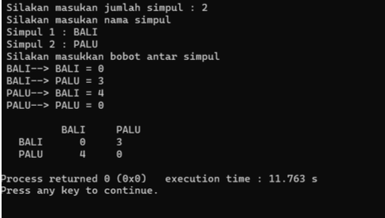

# <h1 align="center">Laporan Praktikum Modul Graph dan Tree</h1>
<p align="center">Amelia Azmi_2311102135</p>

## Dasar Teori


## Guided 

### 1. [Program Graph]

```C++
#include <iostream>

using namespace std;

int main () {
    int n = 10;
    int data[n] = {9, 4, 1, 7, 5, 12, 4, 13, 4, 10}; 
    int cari = 10;
    bool ketemu = false; // Variabel boolean untuk melacak apakah nilai ditemukan
    int i;

    // Loop melalui array untuk mencari nilai
    for (i = 0; i < n; i++) { 
        if (data[i] == cari) {
            ketemu = true;
            break;
        }
    }

    cout << "Program Sequential Search" << endl;
    cout << "data: {9, 4, 1, 7, 5, 12, 4, 13, 4, 10}" << endl;

    // Memeriksa apakah nilai ditemukan dan mencetak pesan yang sesuai
    if (ketemu) { 
        cout << "\nAngka " << cari << " ditemukan pada indeks ke- " << i << endl;
    } else {
        cout << cari << " tidak dapat ditemukan pada data." << endl;
    }

    return 0;
}
```
Program di atas merupakan implementasi dasar dari algoritma pencarian linier (sequential search) dalam bahasa pemrograman C++. Program ini dimulai dengan mendeklarasikan dan menginisialisasi beberapa variabel penting: `n` yang mewakili ukuran array, `data` yang merupakan array berisi sepuluh elemen integer, `cari` yang merupakan nilai yang ingin dicari dalam array, serta `ketemu`, sebuah variabel boolean yang digunakan untuk melacak apakah nilai yang dicari ditemukan dalam array. Nilai awal `ketemu` adalah `false`, menandakan bahwa nilai belum ditemukan. Variabel `i` digunakan sebagai indeks untuk iterasi. Dalam loop `for`, program melakukan iterasi melalui setiap elemen array dari indeks `0` hingga `n-1`. Pada setiap iterasi, program memeriksa apakah elemen saat ini (`data[i]`) sama dengan nilai `cari`. Jika ditemukan kesamaan, `ketemu` diubah menjadi `true` dan loop dihentikan menggunakan pernyataan `break` untuk menghindari iterasi yang tidak perlu. Setelah loop selesai, program mencetak pesan pembuka "Program Sequential Search" dan menampilkan isi array. Kemudian, program memeriksa nilai `ketemu` untuk menentukan hasil pencarian. Jika `ketemu` bernilai `true`, program mencetak bahwa angka yang dicari ditemukan pada indeks tertentu. Jika tidak, program mencetak bahwa angka tersebut tidak ditemukan dalam array. Program ini menggambarkan cara kerja pencarian linier yang sederhana namun efektif untuk dataset kecil, meskipun kurang efisien untuk dataset yang lebih besar karena memiliki kompleksitas waktu O(n).

### 2. [Program Tree]

```C++
#include <iostream>
#include <iomanip>
using namespace std;

struct Pohon {
    char data;
    Pohon *left, *right, *parent;
};

Pohon *root, *baru;

void init() {
    root = NULL;
}

bool isEmpty() {
    return root == NULL;
}

void buatNode(char data) {
    if (isEmpty()) {
        root = new Pohon();
        root->data = data;
        root->left = NULL;
        root->right = NULL;
        root->parent = NULL;
        cout << "\nNode " << data << " berhasil dibuat sebagai root." << endl;
    } else {
        cout << "\nTree sudah ada!" << endl;
    }
}

Pohon* insertLeft(char data, Pohon *node) {
    if (isEmpty()) {
        cout << "\nBuat tree terlebih dahulu!" << endl;
        return NULL;
    } else {
        if (node->left != NULL) {
            cout << "\nNode " << node->data << " sudah ada child kiri!" << endl;
            return NULL;
        } else {
            Pohon *baru = new Pohon();
            baru->data = data;
            baru->left = NULL;
            baru->right = NULL;
            baru->parent = node;
            node->left = baru;
            cout << "\nNode " << data << " berhasil ditambahkan ke child kiri " << baru->parent->data << endl;
            return baru;
        }
    }
}

Pohon* insertRight(char data, Pohon *node) {
    if (isEmpty()) {
        cout << "\nBuat tree terlebih dahulu!" << endl;
        return NULL;
    } else {
        if (node->right != NULL) {
            cout << "\nNode " << node->data << " sudah ada child kanan!" << endl;
            return NULL;
        } else {
            Pohon *baru = new Pohon();
            baru->data = data;
            baru->left = NULL;
            baru->right = NULL;
            baru->parent = node;
            node->right = baru;
            cout << "\nNode " << data << " berhasil ditambahkan ke child kanan " << baru->parent->data << endl;
            return baru;
        }
    }
}

void update(char data, Pohon *node) {
    if (isEmpty()) {
        cout << "\nBuat tree terlebih dahulu!" << endl;
    } else {
        if (!node) {
            cout << "\nNode yang ingin diganti tidak ada!!" << endl;
        } else {
            char temp = node->data;
            node->data = data;
            cout << "\nNode " << temp << " berhasil diubah menjadi " << data << endl;
        }
    }
}

void retrieve(Pohon *node) {
    if (isEmpty()) {
        cout << "\nBuat tree terlebih dahulu!" << endl;
    } else {
        if (!node) {
            cout << "\nNode yang ditunjuk tidak ada!" << endl;
        } else {
            cout << "\nData node : " << node->data << endl;
        }
    }
}

void find(Pohon *node) {
    if (isEmpty()) {
        cout << "\nBuat tree terlebih dahulu!" << endl;
    } else {
        if (!node) {
            cout << "\nNode yang ditunjuk tidak ada!" << endl;
        } else {
            cout << "\nData Node : " << node->data << endl;
            cout << "Root : " << root->data << endl;
            if (!node->parent) {
                cout << "Parent : (tidak punya parent)" << endl;
            } else {
                cout << "Parent : " << node->parent->data << endl;
            }
            if (node->parent != NULL && node->parent->left != node && node->parent->right == node) {
                cout << "Sibling : " << node->parent->left->data << endl;
            } else if (node->parent != NULL && node->parent->right != node && node->parent->left == node) {
                cout << "Sibling : " << node->parent->right->data << endl;
            } else {
                cout << "Sibling : (tidak punya sibling)" << endl;
            }
            if (!node->left) {
                cout << "Child Kiri : (tidak punya Child kiri)" << endl;
            } else {
                cout << "Child Kiri : " << node->left->data << endl;
            }
            if (!node->right) {
                cout << "Child Kanan : (tidak punya Child kanan)" << endl;
            } else {
                cout << "Child Kanan : " << node->right->data << endl;
            }
        }
    }
}

// Penelusuran (Traversal)
// preOrder
void preOrder(Pohon *node = root) {
    if (isEmpty()) {
        cout << "\nBuat tree terlebih dahulu!" << endl;
    } else {
        if (node != NULL) {
            cout << " " << node->data << ", ";
            preOrder(node->left);
            preOrder(node->right);
        }
    }
}

// inOrder
void inOrder(Pohon *node = root) {
    if (isEmpty()) {
        cout << "\nBuat tree terlebih dahulu!" << endl;
    } else {
        if (node != NULL) {
            inOrder(node->left);
            cout << " " << node->data << ", ";
            inOrder(node->right);
        }
    }
}

// postOrder
void postOrder(Pohon *node = root) {
    if (isEmpty()) {
        cout << "\nBuat tree terlebih dahulu!" << endl;
    } else {
        if (node != NULL) {
            postOrder(node->left);
            postOrder(node->right);
            cout << " " << node->data << ", ";
        }
    }
}

// Hapus Node Tree
void deleteTree(Pohon *node) {
    if (isEmpty()) {
        cout << "\nBuat tree terlebih dahulu!" << endl;
    } else {
        if (node != NULL) {
            if (node != root) {
                node->parent->left = NULL;
                node->parent->right = NULL;
            }
            deleteTree(node->left);
            deleteTree(node->right);
            if (node == root) {
                delete root;
                root = NULL;
            } else {
                delete node;
            }
        }
    }
}

// Hapus SubTree
void deleteSub(Pohon *node) {
    if (isEmpty()) {
        cout << "\nBuat tree terlebih dahulu!" << endl;
    } else {
        deleteTree(node->left);
        deleteTree(node->right);
        cout << "\nNode subtree " << node->data << " berhasil dihapus." << endl;
    }
}

// Hapus Tree
void clear() {
    if (isEmpty()) {
        cout << "\nBuat tree terlebih dahulu!!" << endl;
    } else {
        deleteTree(root);
        cout << "\nPohon berhasil dihapus." << endl;
    }
}

// Cek Size Tree
int size(Pohon *node = root) {
    if (isEmpty()) {
        cout << "\nBuat tree terlebih dahulu!!" << endl;
        return 0;
    } else {
        if (!node) {
            return 0;
        } else {
            return 1 + size(node->left) + size(node->right);
        }
    }
}

// Cek Height Level Tree
int height(Pohon *node = root) {
    if (isEmpty()) {
        cout << "\nBuat tree terlebih dahulu!" << endl;
        return 0;
    } else {
        if (!node) {
            return 0;
        } else {
            int heightKiri = height(node->left);
            int heightKanan = height(node->right);
            if (heightKiri >= heightKanan) {
                return heightKiri + 1;
            } else {
                return heightKanan + 1;
            }
        }
    }
}

// Karakteristik Tree
void characteristic() {
    cout << "\nSize Tree : " << size() << endl;
    cout << "Height Tree : " << height() << endl;
    cout << "Average Node of Tree : " << size() / height() << endl;
}

int main() {
    buatNode('A');
    Pohon *nodeB, *nodeC, *nodeD, *nodeE, *nodeF, *nodeG, *nodeH, *nodeI, *nodeJ;

    nodeB = insertLeft('B', root);
    nodeC = insertRight('C', root);
    nodeD = insertLeft('D', nodeB);
    nodeE = insertRight('E', nodeB);
    nodeF = insertLeft('F', nodeC);
    nodeG = insertLeft('G', nodeE);
    nodeH = insertRight('H', nodeE);
    nodeI = insertLeft('I', nodeG);
    nodeJ = insertRight('J', nodeG);

    update('Z', nodeC);
    update('C', nodeC);

    retrieve(nodeC);

    find(nodeC);

    cout << "\nSize Tree: " << size() << endl;
    cout << "Height Tree: " << height() << endl;
    cout << "Average Node of Tree: " << size() / height() << endl;

    cout << "\nPreOrder: ";
    preOrder();
    cout << "\nInOrder: ";
    inOrder();
    cout << "\nPostOrder: ";
    postOrder();
    cout << endl;

    return 0;
}
```
Program diatas merupakan implementasi lengkap dari struktur data pohon biner dalam bahasa pemrograman C++. Program ini dimulai dengan mendefinisikan struktur `Pohon`, yang memiliki atribut untuk menyimpan data (karakter), serta pointer untuk menghubungkan node kiri, kanan, dan induknya. Fungsi `init` menginisialisasi pohon dengan mengatur root ke `NULL`, sementara fungsi `isEmpty` memeriksa apakah pohon kosong. Fungsi `buatNode` membuat node baru sebagai root jika pohon belum ada, dan jika pohon sudah ada, fungsi ini menampilkan pesan bahwa pohon sudah ada. Fungsi `insertLeft` dan `insertRight` digunakan untuk menambahkan node baru sebagai anak kiri atau kanan dari node yang ditentukan, asalkan tidak ada anak kiri atau kanan pada node tersebut. Fungsi `update` memungkinkan perubahan data pada node tertentu, sedangkan fungsi `retrieve` dan `find` digunakan untuk mengambil dan menampilkan informasi detail tentang node tertentu, termasuk data, parent, sibling, dan child-nya.

Program ini juga mendukung berbagai metode traversal pohon: `preOrder`, `inOrder`, dan `postOrder`, yang masing-masing mencetak data node dalam urutan pre-order, in-order, dan post-order. Selain itu, program ini menyediakan fungsi untuk menghapus node: `deleteTree` menghapus seluruh node dalam pohon, `deleteSub` menghapus subtree dari node tertentu, dan `clear` menghapus seluruh pohon. Fungsi `size` menghitung jumlah total node dalam pohon, sedangkan `height` menghitung tinggi pohon, yang digunakan dalam fungsi `characteristic` untuk mencetak ukuran, tinggi, dan rata-rata node dalam pohon.

Dalam fungsi `main`, program membuat pohon dengan root 'A' dan menambahkan beberapa node untuk membentuk struktur pohon yang lebih kompleks. Program juga menunjukkan contoh penggunaan fungsi `update` untuk mengubah data node, serta fungsi `retrieve` dan `find` untuk mengakses dan menampilkan data node. Terakhir, program menghitung dan menampilkan ukuran, tinggi, dan rata-rata node dalam pohon, serta melakukan traversal pohon dengan metode pre-order, in-order, dan post-order. Secara keseluruhan, program ini menyediakan berbagai operasi untuk manipulasi dan pengelolaan pohon biner, menjadikannya alat yang komprehensif untuk bekerja dengan struktur data pohon.

## Unguided 

### 1. [Buatlah program graph dengan menggunakan inputan user untuk menghitung jarak dari sebuah kota ke kota lainnya]



```C++

```
#### Output:


### 2. [Modifikasi guided tree diatas dengan program menu menggunakan input data
tree dari user dan berikan fungsi tambahan untuk menampilkan node child dan
descendant dari node yang diinput kan!]

```C++

```
#### Output:


## Kesimpulan


## Referensi

[1] Wafiqah Setyawati Wahyuni, Septi Andryana, Ben Rahman. 2022. PENGGUNAAN ALGORITMA SEQUENTIAL SEARCHING PADA APLIKASI PERPUSTAKAAN BERBASIS WEB. Jakarta Selatan.

[2] Kartiko Ardi Widodo , Suryo Adi Wibowo, dan Nurlaily Vendyansyah. 2021. PENERAPAN SEQUENTIAL SEARCH UNTUK PENGELOLAAN DATA BARANG. Malang.

[3] Markuci, D., & Prianto, C. 2022. Analisis Perbandingan Penggunaan Algoritma Sequential Search dan Binary Search pada Aplikasi Surat Perjalanan Dinas. Jurnal Informatika dan Komputer, 6(1), 110.